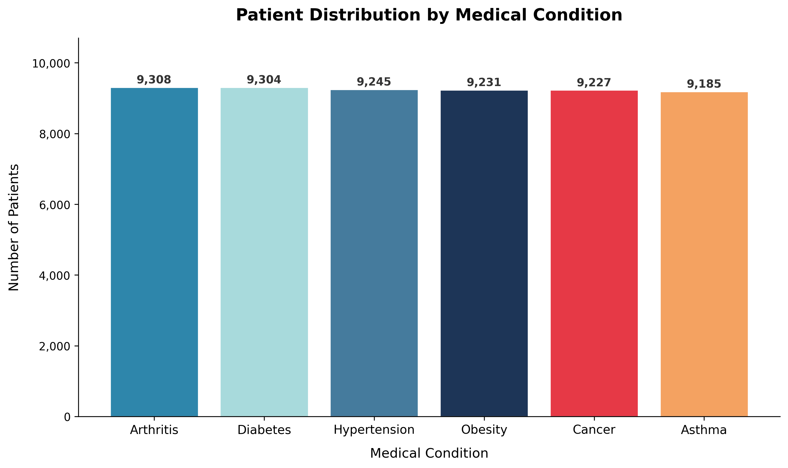
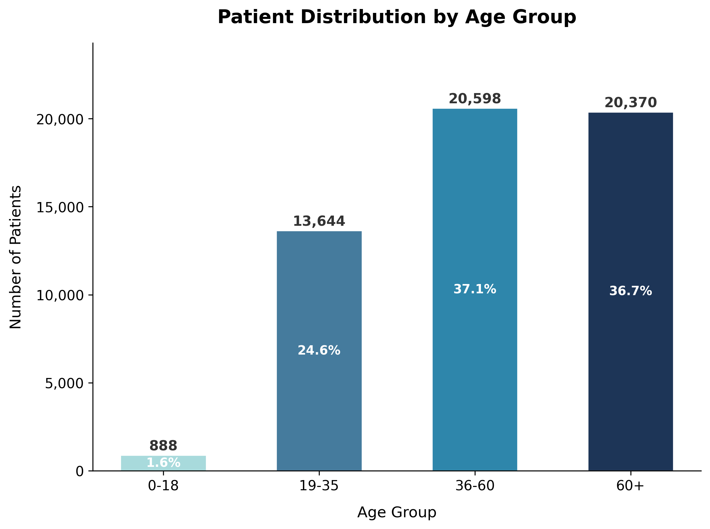
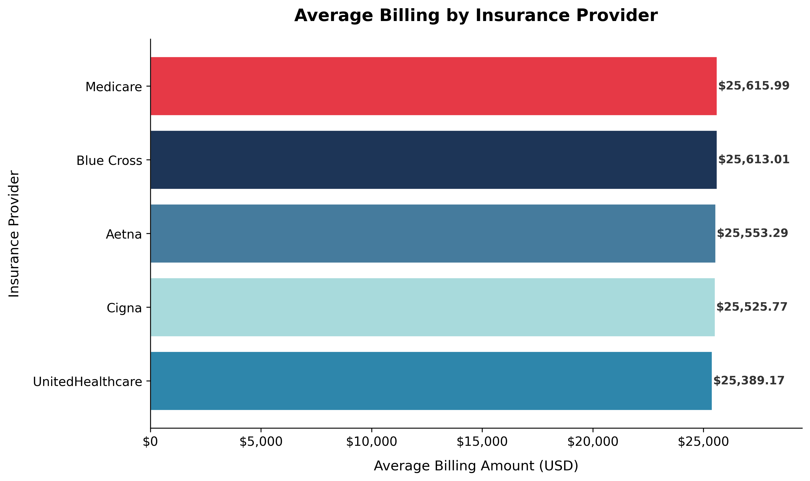
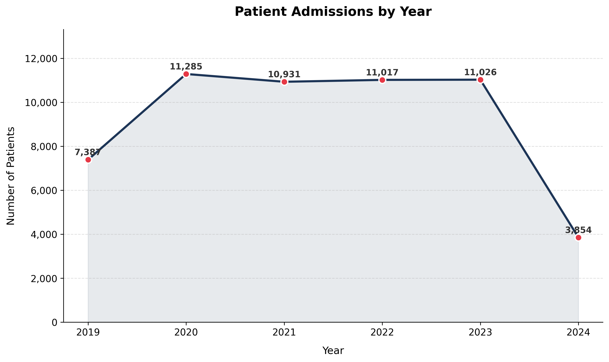

# Hospital Patient Analytics

An end-to-end healthcare data analytics project built with Python, SQLite, and SQL.  
Analyzes 55,500 patient records to surface billing trends, patient segmentation, risk indicators, and year-over-year admission patterns.

---

## Project Architecture

```
CSV Dataset  (data/healthcare_dataset.csv)
     ↓
Python Data Cleaning  (python/cleaning.py)
     ↓
SQLite Database  (hospital.db)
     ↓
SQL Analytics  (sql/queries.sql · sql/advanced_queries.sql)
     ↓
Business Insights  (query_results_final.md)
     ↓
Visualizations  (visualizations/)
```

---

## Tools & Technologies

| Layer | Tool |
|---|---|
| Data Cleaning | Python · pandas |
| Database | SQLite (hospital.db) |
| SQL Analytics | SQLite3 via Python |
| Visualization | matplotlib |
| Documentation | Markdown |

---

## Dataset

- **Source:** [Healthcare Dataset - Kaggle (prasad22)](https://www.kaggle.com/datasets/prasad22/healthcare-dataset)
- **Records:** 55,500 patient records
- **Key columns:** Age, Gender, Medical Condition, Billing Amount, Admission Date, Discharge Date, Insurance Provider, Test Results, Medication, Length of Stay
- **Note:** This is a synthetic dataset created for educational purposes. All patient names and values are artificially generated.

---

## Project Setup

```bash
# 1. Clone the repository
git clone https://github.com/ishagupta0506/healthcare-analytics-sql-python
cd hospital-patient-analytics

# 2. Create and activate virtual environment (Windows)
python -m venv .venv
.\.venv\Scripts\Activate.ps1

# 3. Install dependencies
pip install pandas matplotlib

# 4. Run data cleaning
python python/cleaning.py

# 5. Load data into SQLite
python load_to_sqlite.py

# 6. Run SQL queries
python run_queries.py
python run_advanced_queries.py

# 7. Generate visualizations
python python/visualization.py
```

---

## Data Visualizations

### Patient Distribution by Medical Condition


### Patient Distribution by Age Group


### Average Billing by Insurance Provider


### Patient Admissions by Year


---

## SQL Analytics Highlights

### KPI Analysis
- Total patient count, average/min/max billing, average length of stay

### Patient Segmentation
- Breakdown by medical condition, age group, gender, admission type, day of week

### Billing Analysis
- Average billing per insurance provider, top billed patients, patients above average billing

### Risk Analysis
- Overall abnormal test rate (33.6%), per-condition abnormal rate breakdown

### Insurance Analysis
- Patient volume and average billing across all five insurance providers

### Data Quality Checks
- Identified negative billing values (-$2,008.49 minimum)
- Identified duplicate patient records in top billing results

---

## Advanced SQL Techniques Demonstrated

| Technique | Used In | Purpose |
|---|---|---|
| `HAVING` | advanced_queries.sql | Filter groups where avg billing exceeds dataset mean |
| `Subquery` | queries.sql, advanced_queries.sql | Dynamic threshold filtering |
| `CTE (WITH clause)` | advanced_queries.sql | Modular multi-step query logic |
| `RANK() OVER (PARTITION BY)` | advanced_queries.sql | Per-condition billing rank |
| `LAG() OVER` | advanced_queries.sql | Year-over-year admission trend |
| `JOIN` with subquery | advanced_queries.sql | Per-condition billing benchmarking |
| `CASE WHEN` | queries.sql, advanced_queries.sql | Conditional aggregation and classification |

---

## Key Findings

- **55,500 patient records** analyzed across 6 medical conditions, 5 insurance providers, and 6 years (2019–2024)
- **33.6% abnormal test rate** across the dataset; Obesity records the highest per-condition rate (33.79%)
- **73.8% of patients are aged 36 or above**; the 0–18 group accounts for only 1.6% of records
- **Average billing: $25,539.32**; Medicare has the highest provider average ($25,615.99); UnitedHealthcare the lowest ($25,389.17)
- **Largest year-over-year change:** +3,898 admissions (+52.8%) between 2019 and 2020
- **Data quality issues discovered:** negative billing value (-$2,008.49), duplicate patient records in top billing results
- **All six medical conditions** are near-uniformly distributed (~9,200 records each)
- **Asthma** records the longest average stay (15.7 days); all conditions cluster within a 0.3-day range

---

## Repository Structure

```
hospital-patient-analytics/
│
├── data/
│   ├── healthcare_dataset.csv       # Raw source data
│   └── hospital_cleaned.csv         # Cleaned data after python/cleaning.py
│
├── python/
│   ├── cleaning.py                  # Data cleaning and feature engineering
│   └── visualization.py             # Chart generation script
│
├── sql/
│   ├── queries.sql                  # 16 core SQL queries
│   └── advanced_queries.sql         # 6 advanced SQL queries
│
├── visualizations/
│   ├── patients_by_condition.png
│   ├── patients_by_age_group.png
│   ├── billing_by_insurance.png
│   └── admissions_by_year.png
│
├── hospital.db                      # SQLite database (generated)
├── load_to_sqlite.py                # Loads CSV into hospital.db
├── run_queries.py                   # Executes sql/queries.sql
├── run_advanced_queries.py          # Executes sql/advanced_queries.sql
├── query_results_final.md           # Full query documentation and insights
└── README.md
```

---

## Documentation

- **`query_results_final.md`** — All 22 queries documented with results, business insights, and SQL concepts used

---

## Data Attribution

Dataset: [Healthcare Dataset](https://www.kaggle.com/datasets/prasad22/healthcare-dataset) by prasad22 on Kaggle.  
This is a synthetic dataset created for educational purposes. All patient names and values are artificially generated. All observations in this project are based strictly on the data within `hospital.db`. No causal claims or real-world clinical comparisons are made without explicit data support.
